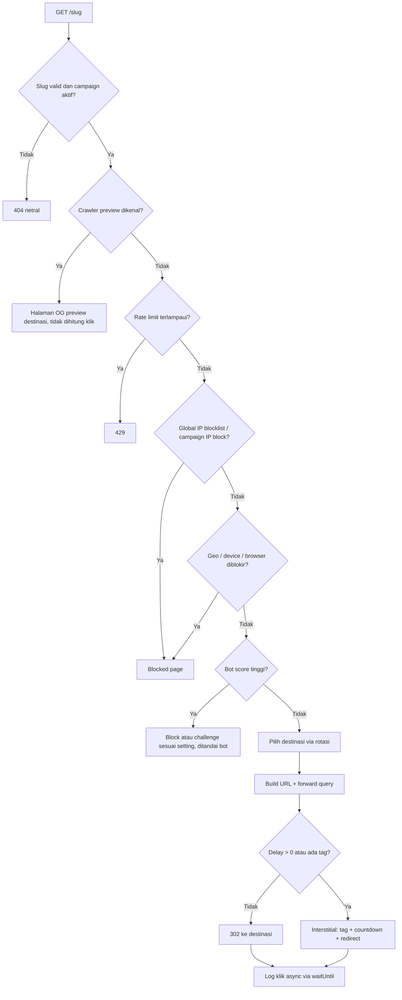

# Roadmap — FB Shortn URL v2

Platform short link + traffic routing untuk link yang dibagikan di Facebook (post/comment), dengan multi-destination, rotasi, aturan blokir, bot filtering, delay redirect, dan analytics tag.

Stack: SvelteKit 2 + Svelte 5 (runes), shadcn-svelte + Tailwind v4, Superforms + Zod 4, Drizzle + Neon Postgres, Better Auth, Upstash Redis, deploy ke Vercel.

---

## 0. Prinsip & Batasan

Dokumen ini dibuat dengan batasan berikut. Batasan ini juga penting untuk **kelangsungan domain platform** — Facebook memblokir domain shortener secara keseluruhan (semua link semua user mati) jika mendeteksi perilaku cloaking.

| ✅ Dibangun | ❌ Tidak dibangun |
|---|---|
| Crawler preview (`facebookexternalhit`, `Facebot`, dll.) menerima preview (OG) yang **sesuai dengan destinasi sebenarnya** | Mendeteksi crawler/reviewer Meta (UA, IP range, ASN) untuk menampilkan halaman berbeda ("safe page" vs "money page") |
| Aturan blokir (geo/IP/device/browser) berlaku **sama** untuk semua pengunjung, hasilnya halaman netral (403/404) | Rute alternatif/fallback URL untuk pengunjung yang diblokir |
| Bot filtering: bot tidak dihitung di statistik, rate limit, challenge opsional | Daftar IP/ASN Meta sebagai preset blokir |
| Scan destinasi (Safe Browsing), abuse report, ban link | — |

---

## 1. Konsep Inti: Alur Redirect

### 1.1 Apa yang sebenarnya diterima server

URL dari Facebook:

```
https://lm.facebook.com/l.php?u=https://domain-platform/slug%2F%3Ffbclid%3DIwdG...&h=AUA6Cp...
```

Setelah Facebook me-redirect, server platform menerima:

```
GET https://domain-platform/slug/?fbclid=IwdG...
```

Catatan penting:

- **`h=` adalah parameter milik `l.php`** (hash link shim Facebook), bukan bagian dari `u`. Parameter ini **tidak pernah sampai** ke platform, jadi tidak bisa diteruskan. Yang diteruskan adalah semua query yang ada di `u` (biasanya `fbclid`, plus UTM jika ada).
- Destinasi harus menerima query dalam bentuk normal: `https://destination.com/?fbclid=IwdG...` — **bukan** `?fbclid%3D...` (versi ter-encode tidak akan terbaca sebagai parameter oleh pixel/analytics destinasi).
- Ada trailing slash (`/slug/`). Default SvelteKit akan me-redirect 308 ke `/slug` → satu hop ekstra. Route slug diset `trailingSlash: 'ignore'`.

### 1.2 Query forwarding (merge rules)

1. Ambil query dari destination URL yang tersimpan (mis. `?ref=abc`).
2. Tambahkan semua query dari request masuk (`fbclid`, `utm_*`, dll.).
3. Jika konflik key: default **destinasi menang** (bisa diubah per campaign: `incoming_wins`).
4. Opsi per campaign: `forwardQuery: all | allowlist | none` (+ daftar key untuk allowlist).
5. Gunakan `URL`/`URLSearchParams` — jangan concat string manual.

### 1.3 Referrer: shortener tidak terbaca sebagai referring site

| Mode | Kapan | Perilaku Referer di destinasi |
|---|---|---|
| **Direct (302/307)** | Delay = 0 dan tanpa analytics tag | Browser tetap mengirim referrer asal (Facebook). Domain shortener **tidak** muncul. Header tambahan: `Referrer-Policy: no-referrer` bisa diaktifkan jika ingin kosong total. |
| **Interstitial (HTML)** | Delay > 0 atau ada analytics tag | Halaman HTML di domain shortener → **wajib** `<meta name="referrer" content="no-referrer">` + header `Referrer-Policy: no-referrer`. Destinasi melihat traffic sebagai *direct*; atribusi tetap terbawa via `fbclid`. |

> Referrer **tidak bisa** "diganti" jadi Facebook dari halaman interstitial. Pilihannya: referrer asli (mode direct) atau kosong (mode interstitial).

Tambahan untuk semua response redirect: `Cache-Control: no-store`, `X-Robots-Tag: noindex`.

### 1.4 Urutan evaluasi (rules engine)



Semua hasil keputusan (allowed / blocked-geo / blocked-ip / bot / dll.) dicatat supaya muncul di analytics sebagai alasan blokir.

---

## 2. Spesifikasi Fitur

### 2.1 Multi Destination URL
- Satu campaign punya 1..N destinasi: `url`, `label`, `weight` (untuk percentage), `priority`, `isActive`, `clickCap` (opsional), `startsAt/endsAt` (opsional).
- Validasi: hanya `http:`/`https:`, tolak `javascript:`, `data:`, IP privat/localhost, dan domain platform sendiri (cegah redirect loop).

### 2.2 Rotating URL
| Strategi | Implementasi |
|---|---|
| `equal` | Round-robin atomik via Redis `INCR rr:{campaignId}` mod jumlah destinasi aktif. Fallback random jika Redis tidak tersedia. |
| `percentage` | Weighted random; validasi total weight = 100 (Zod `refine`). |
| `priority` | Destinasi aktif dengan prioritas tertinggi; turun ke berikutnya jika nonaktif, di luar jadwal, atau `clickCap` tercapai. |

- Opsi **sticky visitor**: cookie `v_{campaignId}` agar pengunjung yang sama selalu ke destinasi yang sama (TTL diatur per campaign).
- Logic rotasi dibuat sebagai pure function → mudah di-unit test.

### 2.3 Aturan Blokir (per campaign + global)
- **Geo country**: header Vercel `x-vercel-ip-country`. Mode `allowlist` atau `denylist`. Reuse `src/lib/utils/country.ts`.
- **IP**: IPv4/IPv6 tunggal + CIDR. `event.getClientAddress()`. Global blocklist (admin) + per campaign. Perluas `src/lib/utils/ipv4-address.ts` untuk IPv6/CIDR.
- **Device type**: `mobile | tablet | desktop | tv | unknown`.
- **Browser type**: `chrome | safari | firefox | edge | samsung | opera | facebook_in_app | instagram_in_app | other`.
  - Deteksi in-app browser Facebook (`FBAN`/`FBAV` di UA) sebagai kategori sendiri — berguna karena mayoritas klik dari FB berasal dari in-app browser.
- Parsing UA dengan `ua-parser-js` (dependency baru), ditambah User-Agent Client Hints jika tersedia.
- Aksi saat diblokir: halaman netral 403 atau 404 (dipilih per campaign). Tidak ada fallback URL.

### 2.4 Bot Protection
Tujuan: statistik akurat dan mencegah traffic abuse/click-fraud.

- **Crawler preview dikenal** (`facebookexternalhit`, `Facebot`, `Twitterbot`, `WhatsApp`, `TelegramBot`, `Slackbot`, `Discordbot`, `LinkedInBot`): menerima halaman OG preview yang sama untuk semua, tidak dihitung klik.
- **Bot scoring** sederhana: UA kosong/headless (`HeadlessChrome`, `puppeteer`, `curl`, `python-requests`), header browser umum tidak ada (`accept-language`, `sec-fetch-*`), request rate per IP tinggi.
- Aksi per campaign: `log_only` (default) | `block` | `challenge` (Cloudflare Turnstile — opsional, fase lanjut).
- Rate limit per IP + slug via Upstash (`@upstash/ratelimit`, dependency baru).

### 2.5 Delay Redirect
- `delayMs`: 0–10.000 ms. 0 = mode direct 302 (jika tanpa tag).
- Interstitial: tampilan minimal (logo platform, countdown, tombol "Lanjutkan" sebagai fallback jika JS mati) + `<noscript><meta http-equiv="refresh">`.
- Redirect via `location.replace()` agar interstitial tidak masuk history (tombol Back tidak loop).

### 2.6 Analytics Tags
- Didukung: **Google Tag (GA4/GTM)**, **Facebook Pixel**, **TikTok Pixel**, **Histats**.
- **Simpan ID saja** (mis. `G-XXXX`, pixel ID numerik, Histats site ID) dan render dari template yang sudah divalidasi — **bukan HTML/script bebas** dari user (mencegah stored XSS). Validasi format ID dengan regex di Zod.
- Tag global (settings platform) + tag per campaign.
- Pastikan tag sempat fire: redirect setelah `max(delayMs, event pixel terkirim)` dengan batas timeout.
- Event yang dikirim: `PageView` (+ opsional custom event `Redirect`).
- Catatan: FB Pixel di domain shortener perlu *domain verification* di Meta Business Manager milik pemilik pixel.

### 2.7 OG Preview
- Per campaign: `ogTitle`, `ogDescription`, `ogImage` (upload via Cloudinary yang sudah ada), atau "ambil otomatis dari destinasi utama".
- Preview harus merepresentasikan destinasi sebenarnya.

---

## 3. Arsitektur & Performa (Vercel)

- **Route redirect**: `src/routes/[slug=slug]/+server.ts` (param matcher `src/params/slug.ts`) supaya tidak bentrok dengan `/about`, `/blog`, `/app`, `/api`, dll. Tambahkan **daftar reserved slug**.
- **Hooks fast-path**: `src/hooks.server.ts` saat ini memanggil `auth.api.getSession()` untuk setiap request. Route redirect harus di-skip lebih awal (tanpa session lookup) supaya latency kecil.
- **Runtime**: Node.js (Fluid compute) dengan region fungsi dekat region Neon.
- **Cache konfigurasi link**: Redis key `link:{slug}` (JSON campaign + destinasi + rules + tags), TTL ± 5 menit, invalidasi saat campaign diubah/dihapus. Miss → query DB → set cache.
- **Logging klik non-blocking**: `waitUntil()` dari `@vercel/functions` (dependency baru).
  - MVP: insert langsung ke `click_event` via Neon HTTP.
  - Scale-up: push ke Redis list → flush batch via Vercel Cron (catatan: Hobby plan cron minimal harian; butuh Pro untuk per-menit) atau Upstash QStash.
- **CloudAMQP**: belum diperlukan. Koneksi AMQP persisten kurang cocok untuk serverless; pertimbangkan hanya jika volume sangat tinggi atau butuh worker terpisah.
- **Privasi**: simpan IP dalam bentuk hash (HMAC + secret) untuk unique visitor; IP mentah hanya untuk evaluasi rule, tidak disimpan (atau disimpan dengan retensi pendek). Retensi raw event (mis. 90 hari) → sisanya di tabel agregat.

---

## 4. Data Model (Drizzle)

Tabel yang sudah ada: `user`, `session`, `account`, `verification`, `two_factor`, `settings`. Enum `campaign_status` dan `rotation_strategy` sudah ada.

| Tabel | Kolom utama |
|---|---|
| `campaign` | `id`, `userId`, `name`, `slug` (unique), `status`, `rotationStrategy`, `delayMs`, `forwardQuery`, `forwardQueryKeys[]`, `queryConflict`, `referrerMode`, `stickyVisitor`, `botAction`, `blockAction`, `ogTitle`, `ogDescription`, `ogImage`, `expiresAt`, `totalClicks` (counter denormalized), timestamps, `deletedAt` (soft delete) |
| `campaign_destination` | `id`, `campaignId`, `url`, `label`, `weight`, `priority`, `isActive`, `clickCap`, `clickCount`, `startsAt`, `endsAt` |
| `campaign_rule` | `id`, `campaignId`, `type` (`geo`/`ip`/`device`/`browser`), `mode` (`allow`/`deny`), `values` (jsonb) |
| `campaign_tag` | `id`, `campaignId` (null = global), `provider` (`gtag`/`fb_pixel`/`tiktok_pixel`/`histats`), `tagId`, `isActive` |
| `click_event` | `id`, `campaignId`, `destinationId`, `ts`, `decision` (`redirected`/`blocked_geo`/`blocked_ip`/`blocked_device`/`blocked_browser`/`bot`/`preview`/`rate_limited`), `country`, `device`, `browser`, `os`, `isInApp`, `ipHash`, `referrerHost`, `hasFbclid` |
| `campaign_stats_daily` | `campaignId`, `date`, `clicks`, `uniqueVisitors`, `blocked`, `bots` (PK: `campaignId + date`) |
| `ip_blocklist` | `id`, `cidr`, `reason`, `createdBy` (global, admin) |
| `invitation` | `id`, `email`, `role`, `token` (hash), `invitedBy`, `expiresAt`, `acceptedAt` |
| `audit_log` | `id`, `actorId`, `action`, `entity`, `entityId`, `meta` (jsonb), `ts` |
| `abuse_report` | `id`, `campaignId`, `reason`, `reporterEmail`, `status`, `ts` |

Index penting: `campaign.slug` (unique), `campaign.userId`, `click_event (campaignId, ts)`, `click_event (ts)`.

---

## 5. Admin Panel

| Route | Akses | Isi |
|---|---|---|
| `/app` | user, admin | Kartu stats (total klik, unique, blocked, bot rate, CTR per destinasi), chart klik harian (`layerchart`, reuse `traffic-chart.svelte`), breakdown negara/device/browser, tabel top campaign. Filter rentang tanggal (`date-range-input.svelte`). Data hanya milik user login; admin bisa toggle "semua user". |
| `/app/links` | user, admin | Tabel (`@tanstack/svelte-table`): search, filter status/strategi, sort, pagination server-side, bulk pause/delete, copy link, QR code. |
| `/app/links/new` | user, admin | Form campaign bertahap (Superforms + Zod): Info → Destinasi & rotasi → Rules → Bot & delay → Tags → OG preview. |
| `/app/links/[id]` | owner, admin | Edit + analytics detail per campaign + log klik terbaru + tombol duplicate. |
| `/app/users` | admin | List, invite via email, edit, change role, change status (active/inactive/banned), delete, reset 2FA. Gunakan Better Auth admin plugin (`listUsers`, `setRole`, `banUser`, `removeUser`). |
| `/app/settings` | admin | Nama/logo platform (sudah ada), reserved slug, global IP blocklist, global analytics tags, default campaign, rate limit, retensi data, Safe Browsing API key status. |
| `/app/audit` | admin | Audit log (route rule sudah disiapkan di `rules.ts`). |
| `/app/reports` | admin | Abuse reports + aksi ban campaign/user. |
| `/app/profile` | semua | Sudah ada (profil, password, 2FA). |

UI: dark/light mode via `mode-watcher` (sudah terpasang), toast & alert dialog yang sudah ada, skeleton loading, empty state, responsif mobile.

---

## 6. Fase Pengerjaan

Ukuran: **S** kecil · **M** sedang · **L** besar.

### Fase 0 — Stabilisasi fondasi (S)
- [x] Selaraskan riwayat migrasi Drizzle dengan database Neon (baseline `0000` via `scripts/db-baseline.mjs`, lalu `0001` default `account.issuer`).
- [x] Perbaiki mismatch role di `src/lib/components/app/sidebar.svelte` (pakai `isAdmin()` dari `src/lib/middleware/rules.ts`).
- [x] Pisahkan vitest menjadi project `server` (node) dan `client` (browser) di `vite.config.ts`.
- [ ] Status user: keputusan → `user.banned` adalah flag enforcement Better Auth, `user.status` mengikutinya (`setUserBan` di `src/lib/server/user.ts` sudah sinkron). Enforcement `inactive` saat login dikerjakan di **Fase 5**.
- [ ] Validasi env dengan Zod → dipindah ke **Fase 2** (bersamaan dengan env baru `IP_HASH_SECRET`). Variabel `$env/static/private` sudah wajib ada saat build.
- [ ] Setup CI minimal (`pnpm check`, unit test project `server`) → butuh `.env.example` yang lengkap agar `svelte-kit sync` bisa generate tipe `$env` di CI.

> Untuk database lain (mis. production) yang tabelnya sudah ada tetapi riwayat migrasinya kosong: `node scripts/db-baseline.mjs --to 0000_open_speed --apply`, lalu `pnpm db:migrate`.

### Fase 1 — Schema & core domain (M)
- [x] Tabel campaign, destination, rule, tag, click_event (+ relations) → migrasi `drizzle/0002_campaigns.sql` (sudah diterapkan).
- [x] Zod schema bersama `src/lib/schemas/campaign.ts` (form create/edit + filter list) + unit test.
- [x] Service layer `src/lib/server/campaign/service.ts` (list/get/create/update/setStatus/remove/duplicate, ownership, soft delete) + `cache.ts` (invalidasi `link:{slug}`). Tersedia via `locals.helper.campaigns`.
- [x] Util slug: reserved list diperbarui dengan route aplikasi yang sebenarnya + unit test.
- [x] Integration test opt-in: `RUN_DB_TESTS=1 pnpm exec vitest --run --project server service.integration`.

### Fase 2 — Redirect engine (L) ✅
- [x] `src/params/slug.ts` — matcher param (SLUG_PATTERN + RESERVED_SLUGS).
- [x] `src/routes/[slug=slug]/+server.ts` — `trailingSlash: 'ignore'`, GET + HEAD.
- [x] Fast-path di `hooks.server.ts` — skip `getSession()` dan `ServiceHelper` untuk slug path.
- [x] `redirect/resolver.ts` — resolve Redis→DB, date revive, `claimClick` (atomic cap), `resolveGlobalTags`.
- [x] `redirect/policy.ts` — `buildDestinationUrl` (query merge), `classifyVisitor` (UA/device/browser/inapp/bot), `normalizeIp`/`matchesIp` (IPv4+IPv6+CIDR mapped), `evaluateRules` (global IP → campaign IP → geo → device → browser), `eligibleDestinations` (schedule+cap), `selectDestination` (equal/percentage/priority + sticky).
- [x] `redirect/identity.ts` — `hashVisitor` (HMAC), `signSticky`/`readSticky` (tamper-proof cookie), `getVisitorAddress`, `getVisitorCountry` (hanya saat `trustVercelGeo=true`).
- [x] `redirect/environment.ts` — `parseRedirectEnvironment` (Zod, IP_HASH_SECRET, Upstash pair, rateLimit, trustVercelGeo).
- [x] `redirect/pages.ts` — `renderPreview` (OG preview, honest), `renderInterstitial` (countdown accessible, tag-consent opt-in, nonce CSP, no-JS fallback, 16 KB dest URL).
- [x] `redirect/logger.ts` — `logClick` via `waitUntil`, `extractReferrerHost`.
- [x] `redirect/engine.ts` — orkestrasi penuh: preview → rate limit → rules → bot → rotasi → cap → cookies → direct 302 / interstitial, GPC/DNT dihormati.
- [x] 325 unit test lolos (`vitest --run --project server`). Browser test opt-in (`RUN_REDIRECT_BROWSER_TESTS=1`) menunggu `playwright install chromium`.

### Fase 3 — Campaign management UI (M) ✅
- [x] `/app/links` — tabel campaign: search, filter status/strategi/sort, pagination URL-based, badge status berwarna, copy link, QR code, dropdown aksi (pause/resume/archive/duplicate/delete).
- [x] `/app/links/new` & `/app/links/[id]/edit` — form 4-step (Basic Info → Destinations → Rules → Tags & Settings): slug preview + generate random, weight total realtime untuk percentage, date picker, step validation client-side.
- [x] Komponen `src/lib/components/app/campaign/`: `status-badge`, `step-indicator`, `campaign-form`, `destination-item`, `rules-editor`, `tags-editor`.
- [x] API routes `src/routes/api/campaign/`: list, create, detail, update, delete, setStatus, duplicate, QR code PNG.
- [x] `/api/campaign` ditambahkan ke `apiRouteRules` (user+admin).

### Fase 4 — Analytics & dashboard (M)
- [ ] Query agregasi (per hari, negara, device, browser, destinasi, decision).
- [ ] Rollup `campaign_stats_daily` (cron harian) + retensi raw event.
- [ ] Dashboard `/app` + analytics detail `/app/links/[id]`.
- [ ] Export CSV.

### Fase 5 — Users management (M)
- [ ] Tabel users (admin) + filter role/status.
- [ ] Invite via email (token hash, expiry) → halaman accept invite → set password.
- [ ] Edit, change role, change status, delete (dengan konfirmasi; cegah admin menghapus/menurunkan dirinya sendiri atau admin terakhir).
- [ ] Audit log untuk semua aksi admin.

### Fase 6 — Settings & safety (M)
- [ ] Settings: global tags, reserved slug, global IP blocklist, rate limit, retensi.
- [ ] Scan destinasi via Google Safe Browsing / Web Risk saat create/update + re-scan berkala.
- [ ] Halaman publik abuse report + `/app/reports`.
- [ ] Halaman Terms/Privacy (route sudah ada) diisi kebijakan penggunaan.

### Fase 7 — Hardening & launch (M)
- [ ] E2E Playwright: create campaign → buka slug dengan `?fbclid=` → cek URL akhir & query, blok geo (mock header), crawler preview.
- [ ] Load test endpoint redirect (target p95 < 150 ms saat cache hit).
- [ ] Security headers/CSP untuk interstitial (izinkan domain tag yang dipakai saja).
- [ ] Observability (`src/lib/server/observability.ts`) + alert error.
- [ ] Deploy Vercel: env production, custom domain, region, cron.

### Backlog (setelah launch)
- Multiple custom domain per user.
- API key + REST API untuk membuat link.
- Link expiry by clicks, password-protected link.
- A/B test report (konversi via postback dari destinasi).
- Cloudflare Turnstile challenge.
- Worker terpisah via QStash/CloudAMQP untuk volume tinggi.

---

## 7. Dependency Baru (usulan)

| Package | Fungsi |
|---|---|
| `ua-parser-js` | Parsing device/browser/OS |
| `@vercel/functions` | `waitUntil`, helper geolocation/IP |
| `@upstash/ratelimit` | Rate limiting |
| `nanoid` (opsional) | Slug random, jika util slug yang ada tidak cukup |

Yang sudah terpasang dan dipakai ulang: `@upstash/redis`, `drizzle-orm`, `better-auth`, `sveltekit-superforms`, `zod`, `@tanstack/svelte-table`, `layerchart`, `qrcode`, `mode-watcher`, `cloudinary`, `nodemailer`/`resend`.

---

## 8. Definition of Done (MVP)

- [ ] Link `https://domain/slug/?fbclid=X` berakhir di `https://destinasi/?fbclid=X` (query destinasi asli tetap ada).
- [ ] Mode direct: 1 hop redirect, domain shortener tidak muncul sebagai referrer.
- [ ] Mode interstitial: tag fire, lalu redirect; destinasi menerima `Referer` kosong.
- [ ] Ketiga strategi rotasi terbukti lewat unit test distribusi.
- [ ] Rule geo/IP/device/browser memblokir sesuai konfigurasi dan tercatat di analytics.
- [ ] Crawler preview mendapat OG yang benar dan tidak dihitung sebagai klik.
- [ ] User hanya bisa melihat/mengubah campaign miliknya; admin bisa semua.
- [ ] Admin bisa invite/edit/role/status/delete user.
- [ ] `pnpm check`, `pnpm lint`, unit test, dan e2e lulus; deploy Vercel berjalan.
